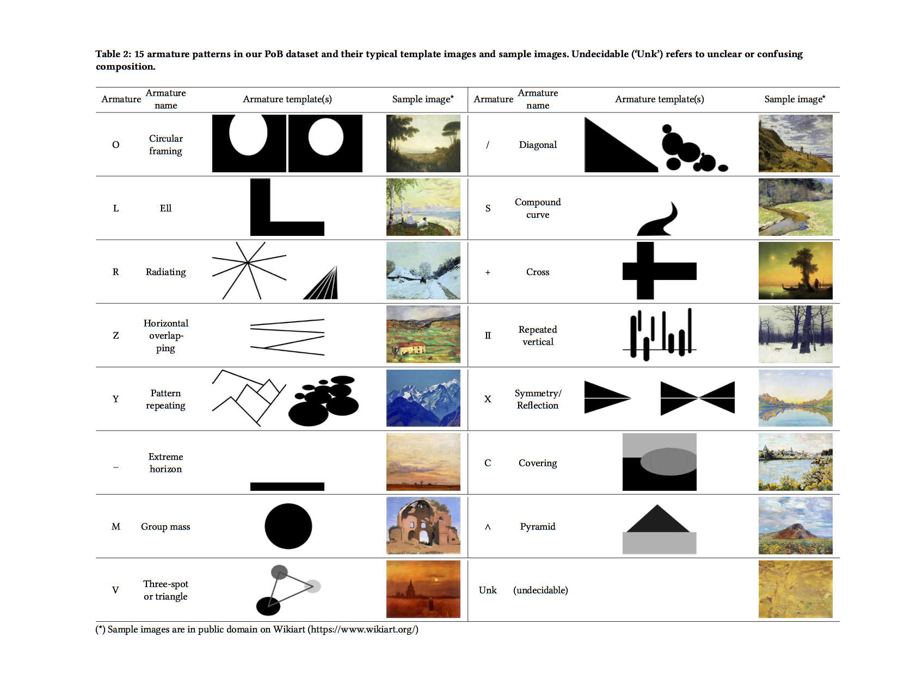

# Conference paper

https://www.researchgate.net/publication/328374750_PoB_Toward_Reasoning_Patterns_of_Beauty_in_Image_Data

Citation:
```
@inproceedings{Nguyen:2018:PTR:3240508.3240711,
 author = {Nguyen, Diep Thi Ngoc and Nakayama, Hideki and Okazaki, Naoaki and Sakaeda, Tatsuya},
 title = {PoB: Toward Reasoning Patterns of Beauty in Image Data},
 booktitle = {Proceedings of the 26th ACM International Conference on Multimedia},
 series = {MM '18},
 year = {2018},
 isbn = {978-1-4503-5665-7},
 location = {Seoul, Republic of Korea},
 pages = {1786--1793},
 numpages = {8},
 url = {http://doi.acm.org/10.1145/3240508.3240711},
 doi = {10.1145/3240508.3240711},
 acmid = {3240711},
 publisher = {ACM},
 address = {New York, NY, USA},
 keywords = {aesthetic assessment, armature pattern, composition, image dataset, visual grammar},
} 

```

# PoB Dataset
A dataset toward reasoning patterns of beauty in image data and construction of visual grammar.

The PoB Dataset encodes the compositional patterns based on our defined 15 patterns in images. The PoB includes two datasets: Painting (4,959 images - a subset of the AVA dataset) and Photograph (10,000 images).

The folder includes 4 subfolders:
	
	- ./images: images. Please download from here: 
		+ Paintings: https://drive.google.com/open?id=11wPfNtqJkenH401AqE38rD8OQMC1tcFa
		+ Photographs: https://drive.google.com/open?id=1sxFQz1Pb5T6lL_sZyAHmQzJmrlMlbZ1n
	- ./Meier-seashore results: results of 25 participants for Meier-seashore art judgment test.
	- ./patterns_annotated_results: annotated results of two annotators ("junior" and "senior") for each Painting and Photograph datasets.
	- ./train_val_test: splitting of images by image_ids for pattern classification problem.
	
# 15 armature patterns

The PoB dataset is labeled based on pre-defined 15 armature (composition) patterns. In art practices and by experiments, there is a high correlation between those patterns and aesthetic values of pictures.




- Circular framing (*O*): Using three or four edges of a picture to frame the objects of interest at the center.
-  Diagonal (*/*): An edge of a object or a series of lines running along two main diagonals of a picture to create a dynamic atmosphere.
-  Ell (*L*): Using two perpendicular edges of a picture plane to create a L-shape frame that either surrounds or holds the objects of interest.
-  S or compound curve (*S*): Using a S-shape curve to lead the eyes to the objects of interest or to create dynamic in a picture.
-  Radiating (*R*): Using lines that converge to a point that emphasizes the objects of interest. Frequently used in one-point perspective drawing.
-  Cross (*+*): Vertical lines cross horizontal lines.
-  Horizontal overlapping (*Z*): Spreading of horizontal regions from bottom of a picture.
-  Repeated vertical (*II*): Many vertical objects that spread from left to right or by depth of a picture.
-  Pattern repeating (*Y*): Repeating of a same pattern to emphasize the pattern.
-  Symmetry/Reflection (*X*): Symmetry over a vertical or horizontal line.
-  Extreme horizon (*\_*): Using an extreme low/high horizon line.
-  Covering (*C*): An elevated view from above in which there is a curved shape (*e.g., full or half circle, eclipse shape*) that surrounds a picture.
-  Group mass (*M*): A macro view of the object of interest in a picture.
-  Pyramid (*^*): Composed of a flat plane at the front side (*bottom of a picture*) and a triangular object perpendicular to the plane at the back side (*top of a picture*).
-  Three-spot or triangle (*V*): Using relative relations between three objects to create a balancing sense in a picture.
